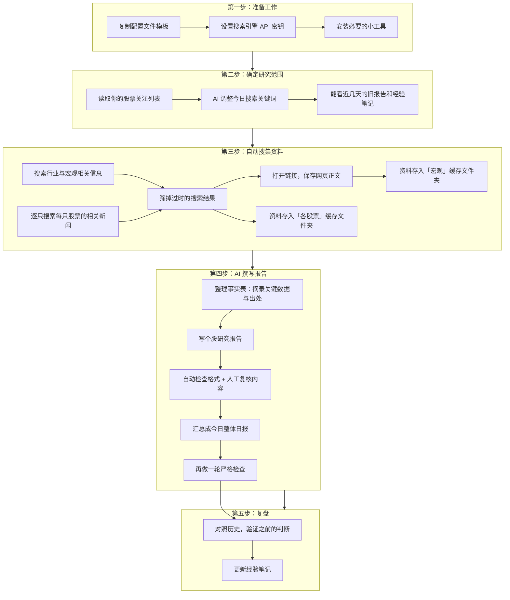

# Daily Stock Research Skill

基于 Agent Skill 的**每日股票池研究**工作流：从 YAML 股票池出发，经 SerpApi 检索与链接抓取落盘缓存，由 Agent **手写**个股事实表与研究报告（禁止用脚本批量生成报告正文）。

> **免责声明**：本 Skill 产出仅供研究参考，不构成投资建议。

## 特性

- **配置驱动股票池**：`sector → sub_sector → stocks`，支持宏观/联动/资讯 query 模板与占位符展开
- **检索 + 抓取落盘**：SerpApi 结果与网页正文缓存至 `reports/<date>/_search-cache/`，改报告先读缓存
- **时效过滤**：自动丢弃过期搜索结果，报告禁止引用 `discarded` 链接
- **结构化研究流程**：事实表 → 个股报告 → 整体日报 → Review 校验
- **经验记录与反思**：对照近 7 日报告验证历史判断（对/错/待验证），提炼可执行经验写入 `reports/_lessons/lessons-learned.md`，下次研究自动参考、持续纠偏
- **彼得林奇分类估值**：估值前先判定公司类型，匹配不同估值锚
- **来源分级**：A/B/C 级来源约束，核心数字须可追溯至 `fetched` 正文

## 系统流程

### 一句话说明

你指定「今天要研究哪些股票」→ 系统自动上网搜集资料并保存 → AI 分析师阅读材料后**逐只手写**研究报告 → 汇总成日报 → 对照历史复盘，越用越准。

### 流程总览




### 各步骤在做什么？


| 步骤         | 谁来做       | 你会得到什么                   |
| ---------- | --------- | ------------------------ |
| **准备工作**   | 你（一次性）    | 配置文件、API 密钥、运行环境就绪       |
| **确定研究范围** | AI        | 今日要搜什么、要研究哪几只股票          |
| **自动搜集资料** | 脚本（机器）    | 新闻、公告、研报等网页正文，按日期和股票分类保存 |
| **撰写报告**   | AI（人工级分析） | 每只股票的事实表 + 研究报告，以及一份整体日报 |
| **复盘**     | AI        | 更新经验笔记，记录哪些判断对了、哪些需要改进   |


#### 第一步：准备工作（首次使用时完成）

把示例配置文件复制成你自己的版本，填入 [SerpApi](https://serpapi.com/) 的 API 密钥（相当于给系统一张「上网搜索通行证」），并安装几个辅助小工具。完成后通常不必每天重复。

#### 第二步：确定研究范围（每次研究开始时）

系统读取你在 `config/industries.yaml` 里维护的**股票池**——按行业、细分板块分组的股票清单。AI 会根据当天日期，把搜索关键词里的「2026 一季报」「最新油价」等占位符替换成最新表述，并快速浏览近 7 日的旧报告和 `lessons-learned.md`（经验笔记），避免重复劳动、延续之前的观察。

#### 第三步：自动搜集资料（机器执行，约几分钟）

这一步类似一位尽职的研究助理在帮你：

1. **搜宏观**：按配置搜索行业政策、大宗商品价格、板块联动等背景信息
2. **搜个股**：对股票池里每一只，搜索财报、公告、新闻、估值相关报道
3. **筛时效**：太旧的结果直接丢弃，避免报告引用过时信息
4. **存正文**：把排名靠前的链接网页内容下载保存到 `reports/<日期>/_search-cache/`

资料全部落盘后，改报告时不必重新上网，直接读本地缓存即可。

#### 第四步：撰写报告（AI 核心工作，质量关键）

AI 像分析师一样**阅读**第三步保存的材料，按固定流程输出：

1. **事实表**（`facts.md`）—— 先把关键数字、事件、原文摘录整理成表格，标明每条信息来自哪篇文章（A/B/C 来源分级）
2. **个股报告**（`report.md`）—— 在事实基础上写分析：公司类型、估值方法、高低估判断、风险点
3. **自动校验** —— 脚本检查报告有没有引用已丢弃的链接、格式是否合规
4. **整体日报**（`daily-research-report.md`）—— 把所有个股结论汇总，附行业宏观摘要
5. **严格复核** —— 日报完成后再做一轮完整检查

> **重要设计**：报告正文、估值结论、高低估分析**不能**用脚本批量生成，必须由 AI 阅读材料后逐字撰写。这样能保证每份报告都经过「理解 → 判断 → 表达」，而不是模板填空。

#### 第五步：复盘（让系统越用越准）

对照之前几日的报告，看看当时的判断（如「低估」「关注某催化剂」）是否被后续走势或新信息验证。把心得写入 `reports/_lessons/lessons-learned.md`，下次研究时会自动参考。

### 机器与 AI 的分工


| 交给机器（脚本）        | 交给 AI（分析师）      |
| --------------- | --------------- |
| 上网搜索、打开链接、保存网页  | 阅读材料、提炼事实、形成观点  |
| 过滤过时结果、检查引用是否合规 | 写事实表、个股报告、整体日报  |
| 合并和缓存资料，方便反复查阅  | 估值分析、高低估判断、风险梳理 |


简单说：**机器负责「找资料」，AI 负责「读资料、写报告」**。报告里每一个结论，都应该能在缓存的原文中找到依据。

## 目录结构

```
daily-stock-research-skill/
├── SKILL.md                      # Agent 工作流主文档
├── README.md
├── .env.example
├── requirements.txt
├── config/
│   ├── industries.example.yaml   # 股票池示例 → 复制为 industries.yaml
│   └── settings.example.yaml     # 全局设置示例 → 复制为 settings.yaml
├── scripts/                      # 检索、抓取、校验脚本
├── templates/                    # 报告模板
├── guides/                       # 缓存 / Review / 复盘规范
└── reports/                      # 产出目录（_search-cache/ 不提交；示例报告可提交）
    ├── <YYYY-MM-DD>/
    │   ├── daily-research-report.md
    │   └── _search-cache/        # 本地检索缓存（gitignore）
    └── _lessons/lessons-learned.md
```

## 快速开始

### 1. 安装 Skill

本仓库根目录即为 Skill 包（`SKILL.md` 在根目录），克隆到 Cursor 个人 Skill 目录：

```bash
git clone https://github.com/ZeroAGI/daily-stock-research-skill.git \
  ~/.cursor/skills/daily-stock-research-skill
```

也可克隆到任意目录作为研究工作区，在 Cursor 中打开该文件夹即可直接运行 `scripts/` 下的脚本。

> Cursor 从 `~/.cursor/skills/<name>/SKILL.md` 或项目内 `.cursor/skills/<name>/SKILL.md` 发现 Skill。本仓库设计为**整仓克隆即 Skill**，无需 `.cursor` 子目录。

### 2. 系统依赖


| 依赖               | 用途                 | 安装示例                              |
| ---------------- | ------------------ | --------------------------------- |
| `bash`           | 检索脚本               | 系统自带                              |
| `curl`           | SerpApi HTTP 请求    | 系统自带                              |
| `jq`             | JSON 处理            | `brew install jq`                 |
| `python3`        | 展开 query、抓取、校验     | 系统自带                              |
| `parallel` (GNU) | 批量并行检索             | `brew install parallel`           |
| PyYAML           | 解析 industries.yaml | `pip install -r requirements.txt` |


### 3. 配置 SerpApi

1. 在 [SerpApi](https://serpapi.com/) 注册并获取 API Key：[Manage API Key](https://serpapi.com/manage-api-key)
2. 复制环境变量模板并填入密钥：

```bash
cp .env.example .env
# 编辑 .env，设置 SERPAPI_KEY=...
export $(grep -v '^#' .env | xargs)   # 或写入 ~/.zshrc
```

3. 验证连通性：

```bash
curl -sS -G "https://serpapi.com/search.json" \
  --data-urlencode "engine=google" \
  --data-urlencode "q=test" \
  --data-urlencode "api_key=${SERPAPI_KEY}" \
  | jq '.organic_results[0].title'
```

**默认端点**：`https://serpapi.com/search.json`（与 [SerpApi 官方文档](https://serpapi.com/search-api) 一致）


| 环境变量               | 说明             | 默认值                               |
| ------------------ | -------------- | --------------------------------- |
| `SERPAPI_KEY`      | API 密钥（**必填**） | —                                 |
| `SERPAPI_ENDPOINT` | 检索端点           | `https://serpapi.com/search.json` |
| `PARALLEL_JOBS`    | 批量检索并行度        | `8`                               |
| `MAX_FETCH`        | 每条 query 抓取链接数 | `5`                               |
| `FETCH_PARALLEL`   | 单 query 内并行抓取数 | `5`                               |
| `MAX_CHARS`        | 单页正文最大字符数      | `500000`                          |


`config/settings.example.yaml` 中的 `serpapi.base_url` 与上述默认一致，供 Agent 阅读参考；脚本实际以环境变量 `SERPAPI_ENDPOINT` 为准。

### 4. 配置股票池

```bash
cp config/industries.example.yaml config/industries.yaml
cp config/settings.example.yaml config/settings.yaml
```

编辑 `config/industries.yaml`，按你的关注列表扩展 `sector / sub_sector / stocks` 及各类 queries。占位符会在运行时由 `expand-queries.py` 展开：


| 占位符                | 含义      | 示例（2026-06-24） |
| ------------------ | ------- | -------------- |
| `{year}`           | 当前年     | `2026`         |
| `{month}`          | 当前月（两位） | `06`           |
| `{latest_quarter}` | 最近披露报告期 | `2026 一季报`     |
| `{last_fy}`        | 上一完整财年  | `2025`         |
| `{name}` `{code}`  | 个股名称与代码 | —              |


### 5. 运行

在 Cursor 中对 Agent 说：

> 使用 daily-stock-research skill，跑今日股票池研究。

或分步手动执行检索：

```bash
# 全池并行检索+抓取
export PARALLEL_JOBS=8 MAX_FETCH=5
scripts/batch-search-fetch.sh $(date +%Y-%m-%d)

# 只跑某只股票
scripts/batch-search-fetch.sh $(date +%Y-%m-%d) --code 600938

# 只跑宏观
scripts/batch-search-fetch.sh $(date +%Y-%m-%d) --macro-only
```

检索完成后，由 Agent 按 [SKILL.md](SKILL.md) 撰写 `facts.md` → `report.md` → `daily-research-report.md`。

## 工作流概要

1. **读取配置** — `industries.yaml` + `settings.yaml`
2. **更新 queries** — Agent 根据当日时效调整宏观/事件型 query
3. **读取历史** — 回看近 7 日报告与 `lessons-learned.md`
4. **宏观检索+抓取** — `_search-cache/macro/`
5. **逐股检索+抓取** — `_search-cache/stocks/{code}/`
6. **事实表** — 每只股票先写 `facts.md`（来源分级 + 原文摘录）
7. **个股报告** — `report.md`，写完即 `verify-report.py` Review
8. **整体日报** — `daily-research-report.md`，`verify-report.py --strict`
9. **复盘** — 验证历史判断，更新 `lessons-learned.md`

详细规则、模板与 Review 清单见 [SKILL.md](SKILL.md)。

## 产出示例

以下为 **2026-06-24** 一次完整跑通后的真实产出（石油 + 银行各 2 只），可直接点开阅读。报告中的 `_search-cache/` 链接指向本地检索缓存（仓库未提交），克隆后需自行运行检索脚本生成。

| 类型          | 文件                                                                                                            |
| ----------- | ------------------------------------------------------------------------------------------------------------- |
| **整体日报**    | [daily-research-report.md](reports/2026-06-24/daily-research-report.md)                                       |
| 中国海油 600938 | [facts.md](reports/2026-06-24/石油/油气开采/中国海油/facts.md) · [report.md](reports/2026-06-24/石油/油气开采/中国海油/report.md) |
| 中国石油 601857 | [facts.md](reports/2026-06-24/石油/油气开采/中国石油/facts.md) · [report.md](reports/2026-06-24/石油/油气开采/中国石油/report.md) |
| 工商银行 601398 | [facts.md](reports/2026-06-24/银行/国有大行/工商银行/facts.md) · [report.md](reports/2026-06-24/银行/国有大行/工商银行/report.md) |
| 招商银行 600036 | [facts.md](reports/2026-06-24/银行/国有大行/招商银行/facts.md) · [report.md](reports/2026-06-24/银行/国有大行/招商银行/report.md) |


[整体日报](reports/2026-06-24/daily-research-report.md) 摘要：

- **宏观**：Brent 约 77–79 美元/桶，LPR 1Y 3.00% / 5Y 3.50%，商业银行净息差 1.40%（2026 Q1）
- **结论**：「周期复苏（石油）+ 红利防御（银行）」双主线，整体 **偏多**（置信度：中）
- **估值总览**：海油/中石油 **合理偏低估**；工行/招行 **低估**
- **板块排序**：石油 海油 > 中石油；银行 招行 > 工行

目录结构：

```
reports/2026-06-24/
├── daily-research-report.md          ← 整体日报
├── _search-cache/                    ← 本地缓存，不提交
├── 石油/油气开采/
│   ├── 中国海油/  facts.md · report.md
│   └── 中国石油/  facts.md · report.md
└── 银行/国有大行/
    ├── 工商银行/  facts.md · report.md
    └── 招商银行/  facts.md · report.md
```

## 常见问题

**Q: `SERPAPI_KEY required` 报错？**  
确保已 `export SERPAPI_KEY=...`，或在运行前 `source .env`。

**Q: `parallel: command not found`？**  
安装 GNU parallel：`brew install parallel`。macOS 自带 `parallel`（Perl 版）不兼容，需用 `gnuparallel` 或调整 PATH。

**Q: 抓取正文失败？**  
部分站点有反爬；脚本会标记 `status: error`，报告中不得将此类来源作为核心数字依据。

**Q: 如何减小股票池？**  
编辑 `config/industries.yaml`，示例文件仅含石油、银行各 2 只股票，可按需增删。

## License

[MIT](LICENSE)

---

> **免责声明**：本仓库全部产出（事实表、个股报告、日报、经验库）仅供研究参考，**不构成投资建议**。